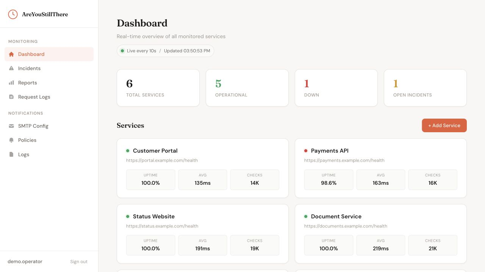
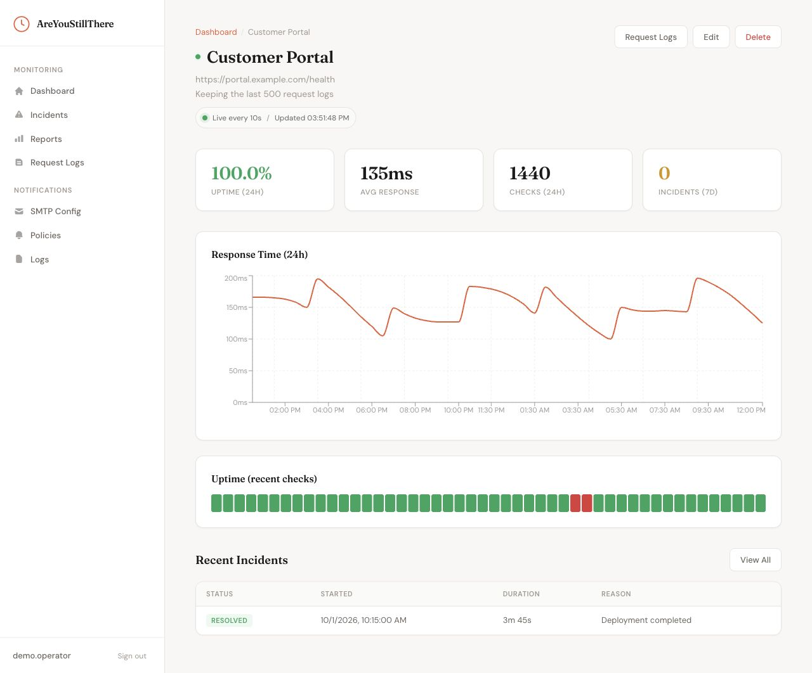
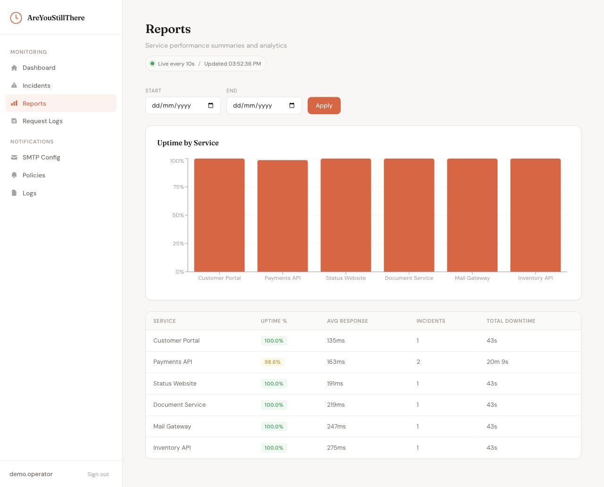
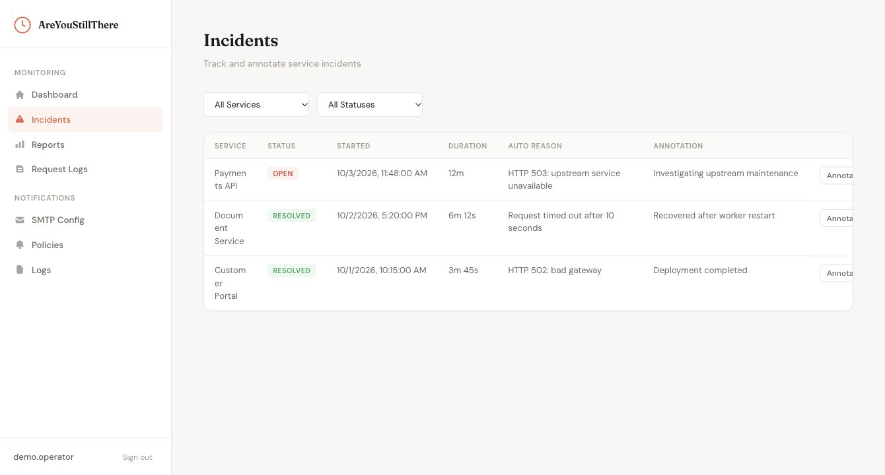
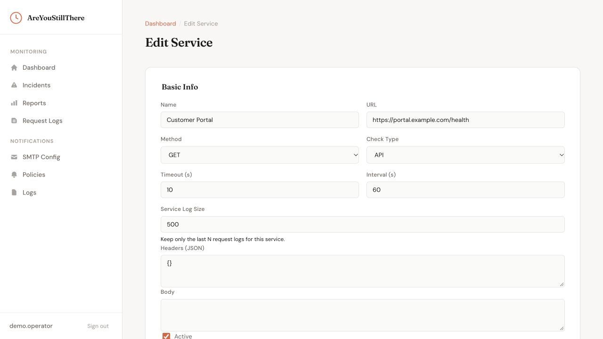

<div align="center">

# AreYouStillThere

**Know when a service goes quiet.**

Self-hosted service monitoring with HTTP checks, response validation, incident history, and email notifications.


[Features](#features) · [Screenshots](#screenshots) · [Quick start](#quick-start) · [Development](#development)



</div>

---

Watch the services you depend on from one dashboard. Check availability and response content, see how performance changes over time, and keep a record of outages and recoveries.

## Features

| Feature | What it does |
|---|---|
| **Checks that fit your service** | Configure HTTP methods, headers, request bodies, timeouts, and check intervals. |
| **Validate the response** | Check status codes and response content, with retry policies for failed checks. |
| **See the history** | Follow response times, uptime, incidents, downtime, and aggregated reports. |
| **Inspect individual requests** | Review recorded check results and response previews; set how many request logs each service retains. |
| **Send outage and recovery emails** | Configure SMTP, choose notification policies and recipients, and inspect delivery logs. |
| **Run on your infrastructure** | Django and React with Celery scheduling; the Compose stack includes PostgreSQL, Redis, Gunicorn, and Nginx. |

## Screenshots

<table align="center" width="100%">
  <tr>
    <td width="50%" align="center" valign="top"><br><sub>Inspect response times and recent checks</sub></td>
    <td width="50%" align="center" valign="top"><br><sub>Compare uptime and performance</sub></td>
  </tr>
  <tr>
    <td width="50%" align="center" valign="top"><br><sub>Track and annotate incidents</sub></td>
    <td width="50%" align="center" valign="top"><br><sub>Configure checks for each service</sub></td>
  </tr>
</table>

Screenshots show the application interface with demo services and check history.

## Quick start

### With Docker Compose

```sh
cp .env.example .env
```

Set `SECRET_KEY`, `POSTGRES_PASSWORD`, and a valid `FIELD_ENCRYPTION_KEY` in `.env`. Generate a Fernet key in a Python environment with `cryptography` installed:

```sh
python -c "from cryptography.fernet import Fernet; print(Fernet.generate_key().decode())"
```

Then start the stack:

```sh
docker compose up --build -d
```

Open **http://localhost:18080** and register an account. Add a service, configure its validation and retry behavior, then set up SMTP and notification policies if you want email alerts.

Compose starts the database, Redis, API, Celery worker, Celery beat, and the web proxy. Change `APP_PORT` in `.env` to use another port.

### Without Docker

**Requirements:** Python 3.12+, Node.js 20+, npm, and Redis for background checks.

```sh
cd backend
python3 -m venv .venv
source .venv/bin/activate
pip install -r requirements.txt
cp .env.example .env
```

Set a real `SECRET_KEY` and a valid Fernet `FIELD_ENCRYPTION_KEY` in `backend/.env`; keep `DEBUG=True` for local development. Then:

```sh
python manage.py migrate
python manage.py runserver
```

In another terminal:

```sh
cd frontend
npm ci
npm start
```

Open **http://localhost:3000**. The API runs at **http://localhost:8000/api/**. On Windows, activate the Python environment with `.venv\Scripts\Activate.ps1` and use `Copy-Item` to copy environment files.

For scheduled monitoring, run Redis and these processes in separate terminals from `backend/` with the Python environment active:

```sh
celery -A config worker --loglevel=info
```

```sh
celery -A config beat --loglevel=info
```

Use `--pool=solo` for the worker on Windows. The dashboard and API can run without Celery, but scheduled checks require the worker and beat. Active services receive database-backed periodic tasks based on their check interval.

## Configuration

| Variable | Purpose |
|---|---|
| `SECRET_KEY`, `DEBUG`, `ALLOWED_HOSTS` | Django secret, development mode, and accepted hosts |
| `FIELD_ENCRYPTION_KEY` | Fernet key for encrypted fields; retain the same key across restarts |
| `DATABASE_URL` | Database connection; Compose supplies PostgreSQL |
| `CELERY_BROKER_URL`, `CELERY_RESULT_BACKEND` | Redis connections for background jobs |
| `CORS_ALLOWED_ORIGINS` | Allowed frontend origins |
| `REACT_APP_API_BASE` | Frontend API base; local default is `http://localhost:8000/api` |

See [.env.example](.env.example), [backend/.env.example](backend/.env.example), and [frontend/.env.example](frontend/.env.example) for the configuration templates.

## API

Authenticate through `POST /api/auth/register/`, `POST /api/auth/token/`, and `POST /api/auth/token/refresh/`. Protected requests use `Authorization: Bearer <access_token>`.

| Resource | Purpose |
|---|---|
| `/api/services/` | Service configuration, individual stats, and bulk stats |
| `/api/validation-rules/`, `/api/retry-policies/` | Response validation and retries |
| `/api/ping-endpoints/` | Supplementary network reachability checks |
| `/api/check-results/`, `/api/incidents/`, `/api/reports/` | Check history, outages, and reports |
| `/api/notifications/smtp-config/` | SMTP configuration and test send |
| `/api/notifications/policies/`, `/api/notifications/logs/` | Recipients, notification rules, and delivery history |

## Development

| Area | Commands |
|---|---|
| Frontend | `npm run build` and `npm test -- --watchAll=false` from `frontend/` |
| Backend | `python manage.py test` from `backend/` |
| Compose | `docker compose ps`, `docker compose logs backend --tail 200`, `docker compose down` |

| Path | Contents |
|---|---|
| `backend/monitoring/` | Services, checks, retries, incidents, reports, and scheduling |
| `backend/notifications/` | SMTP configuration, policies, and delivery logs |
| `backend/config/` | Django configuration and Celery setup |
| `frontend/src/pages/` | Dashboard, check history, reports, and notification screens |
| `docs/screenshots/` | README screenshot tour |

## License

[MIT](LICENSE).
